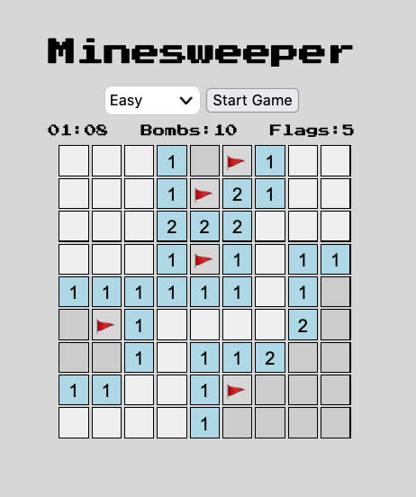
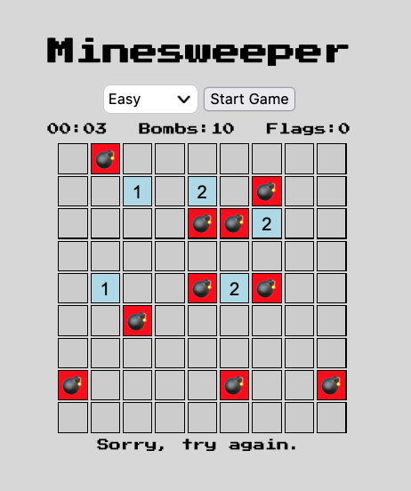

# Minesweeper

Relive your greatest childhood memory with this classic puzzle game.

## How to Play

Reveal squares of the grid by clicking or tapping on them. If a square containing a mine is revealed, the player loses the game. If no mine is revealed, a digit is displayed in the square, indicating how many adjacent squares contain mines; using this information, the player can proceed to reveal additional squares. The game is won when all mine-free squares are revealed.

### Controls

- **Left Click**: Reveals what is under the square.
- **Right Click**: Places a flag on a square to indicate a suspected mine.

## Screenshots

*Initial gameplay of Minesweeper showing a partially cleared board.*

*The game board after revealing a mine.*

## Technologies Used

- **JavaScript**: For game logic and interactivity.
- **HTML5**: For structuring the game's display on the web.
- **CSS3**: For styling the appearance of the game.

## Next Steps

- **Add Custom Difficulty Levels**: Allowing players to choose different sizes and mine densities.
- **Leaderboard**: Implement a system to record player scores and times.
- **Mobile Compatibility**: Ensure the game is fully playable on mobile devices.
- **Double Click**: (on a numbered square) Reveals adjacent squares automatically if flagged mines match the number.

## Contributing

We welcome contributions to this project! If you have suggestions or improvements, please fork the repository and submit a pull request.

## License

This project is licensed under the MIT License - see the LICENSE.md file for details

## Acknowledgments

- Inspiration from the original Microsoft Minesweeper game.
- Thanks to Shaoquan and Waihon from the GA instructional team for their advice and guidance.
- Thanks to [Stack Overflow](https://stackoverflow.com) for helping solve several tricky bugs.
- Thanks to [ChatGPT](https://openai.com/) for creating this template.
